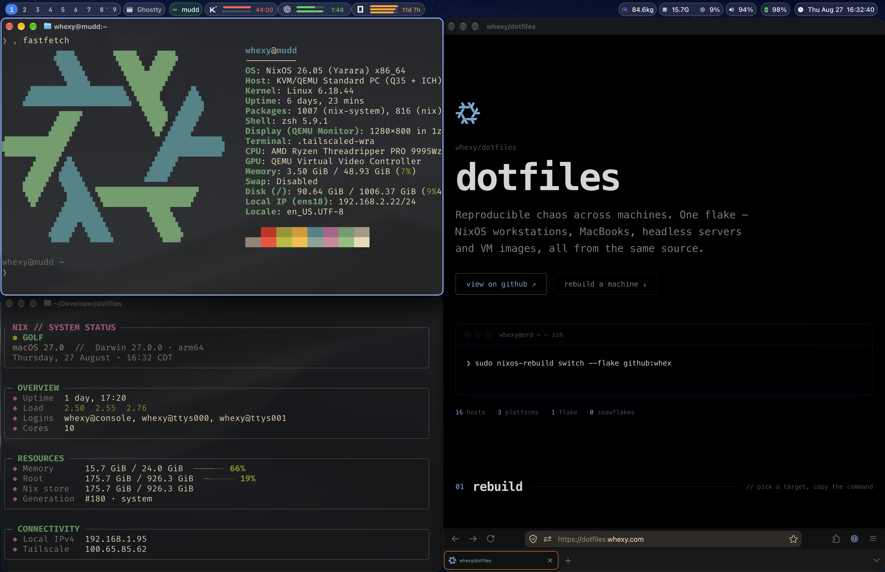

<picture>  </picture>

# Dotfiles

<picture>  </picture>

My personal Nix configuration for all my machines: NixOS, Macs, WSL.

### Layout

The flake is built on [blueprint](https://github.com/numtide/blueprint), so
hosts and users are discovered from the directory layout. Custom host helpers
wire in caps, host metadata, platform packages, and Home Manager for each
integrated user.

### Capabilities and Features

Caps are preset modules that assign feature options. A host picks its caps and
then overrides individual options where needed.

Feature modules are semantic groups: `default.nix` declares the options,
`nixos.nix` / `darwin.nix` hold the platform-specific config.

### Secrets and Remote access

Secrets are age-encrypted with agenix and only decrypted on the hosts that need
them.

Tailscale on everything, so I can safely expose services in private network.

### Automation

Woodpecker CI evaluates configurations on every push and runs the pre-commit
checks (treefmt, statix, nil, deadnix).

Nightly, a GitHub App bot updates `flake.lock` when inputs drift.

Servers and standalone Home Manager setups auto-upgrade daily from the flake, so
the fleet stays near the same revision.
