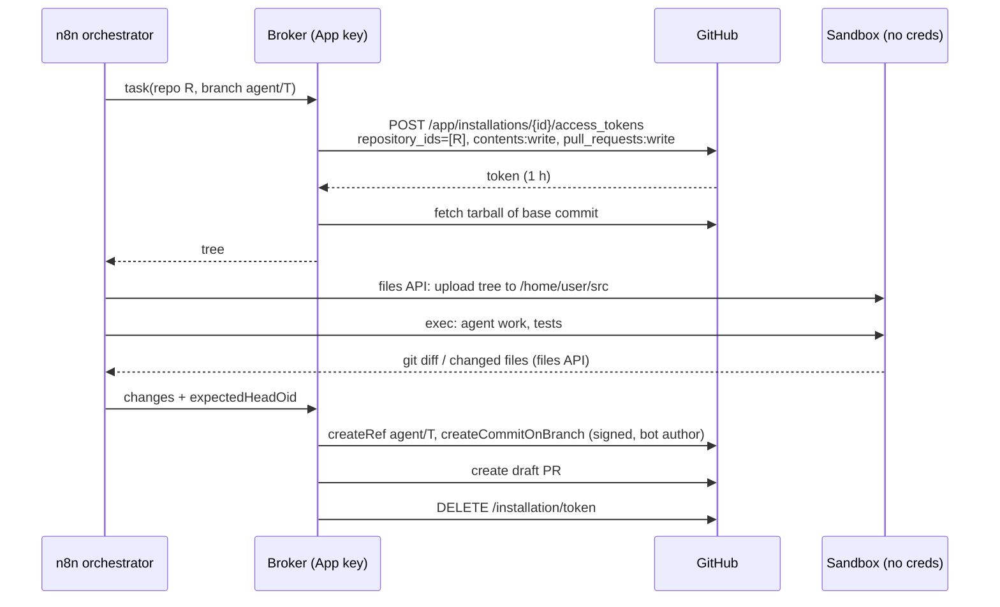

# 4. Git access: authentication, identity, signing

Goal: clone, fetch, commit, push and open PRs with least privilege, without
the owner's personal SSH key, and with authentication, identity and signing
kept separate.

## Credential options

Sources are GitHub docs (API version 2026-03-10) unless marked otherwise.

| Credential                        | Scope                                                                                                                                             | Lifetime                                                                                                                                                        | Revocation                                                                                                                              | PRs                                                                                                                 | Pushes trigger CI                                                                                                                                   | Can edit `.github/workflows`     | Audit actor                                                                                                                                                                                                                           |
| --------------------------------- | ------------------------------------------------------------------------------------------------------------------------------------------------- | --------------------------------------------------------------------------------------------------------------------------------------------------------------- | --------------------------------------------------------------------------------------------------------------------------------------- | ------------------------------------------------------------------------------------------------------------------- | --------------------------------------------------------------------------------------------------------------------------------------------------- | -------------------------------- | ------------------------------------------------------------------------------------------------------------------------------------------------------------------------------------------------------------------------------------- |
| **GitHub App installation token** | Per token: ≤500 repo IDs, subset of app permissions [D](https://docs.github.com/en/rest/apps/apps#create-an-installation-access-token-for-an-app) | **1 h**                                                                                                                                                         | `DELETE /installation/token` [D](https://docs.github.com/en/rest/apps/installations#revoke-an-installation-access-token); uninstall app | Yes                                                                                                                 | Yes (only `GITHUB_TOKEN` pushes don't [D](https://docs.github.com/en/actions/how-tos/write-workflows/choose-when-workflows-run/trigger-a-workflow)) | Only with `workflows` permission | `app[bot]`, `hashed_token` in the audit log [D](https://docs.github.com/en/organizations/keeping-your-organization-secure/managing-security-settings-for-your-organization/identifying-audit-log-events-performed-by-an-access-token) |
| App user-to-server token          | Intersection of user and app access                                                                                                               | 8 h, 6-month refresh [D](https://docs.github.com/en/apps/creating-github-apps/authenticating-with-a-github-app/generating-a-user-access-token-for-a-github-app) | Revoke authorization                                                                                                                    | Yes                                                                                                                 | Yes                                                                                                                                                 | With `workflows`                 | The user (with app badge)                                                                                                                                                                                                             |
| Fine-grained PAT                  | One owner, selected repos, fine permissions                                                                                                       | Default 30 days, max 366 [D](https://docs.github.com/en/authentication/keeping-your-account-and-data-secure/managing-your-personal-access-tokens)               | Manual                                                                                                                                  | Yes                                                                                                                 | Yes                                                                                                                                                 | With `workflows`                 | **The owner**                                                                                                                                                                                                                         |
| Classic PAT                       | Every repo the user can access                                                                                                                    | Optional expiry                                                                                                                                                 | Manual                                                                                                                                  | Yes                                                                                                                 | Yes                                                                                                                                                 | With `workflow` scope            | The owner                                                                                                                                                                                                                             |
| Deploy key (SSH)                  | One repo, read-only or read/write                                                                                                                 | **Never expires** [D](https://docs.github.com/en/authentication/connecting-to-github-with-ssh/managing-deploy-keys)                                             | Delete key                                                                                                                              | **No**: SSH has no REST API auth [D](https://docs.github.com/en/rest/authentication/authenticating-to-the-rest-api) | Yes                                                                                                                                                 | Unverified                       | Not tied to a user                                                                                                                                                                                                                    |
| SSH agent forwarding / socket     | Everything the key can reach (the whole account)                                                                                                  | While the socket is open                                                                                                                                        | Close socket                                                                                                                            | No                                                                                                                  | Yes                                                                                                                                                 | Yes                              | The owner                                                                                                                                                                                                                             |

Notes:

- **An SSH agent socket in the sandbox is usable by the agent.**
  ssh_config(5): users who can reach the socket "can access the local agent
  through the forwarded connection"
  [D](https://man.openbsd.org/ssh_config). The agent is that user. `ssh-add -c`
  needs a human, and `-h` still allows `github.com`
  [D](https://man.openbsd.org/ssh-add). Rejected.
- **Deploy keys** can't open PRs, never expire, and are usually
  passphrase-less. GitHub's own page recommends Apps instead. Rejected.
- **Fine-grained PAT**: acceptable only for a short PoC shortcut (one scratch
  repo, 7-day expiry), because actions are attributed to the owner.
- **`workflows` permission**: without it, a push that touches
  `.github/workflows/*` is refused. That stops the agent from rewriting CI to
  exfiltrate repository secrets
  [D](https://docs.github.com/en/rest/authentication/permissions-required-for-github-apps).
  Never grant it to the agent app.

## Branch and path guardrails (rulesets)

[D](https://docs.github.com/en/repositories/configuring-branches-and-merges-in-your-repository/managing-rulesets/available-rules-for-rulesets):

- **Restrict updates and deletions** on `~DEFAULT_BRANCH` and `release/**`.
  The agent app is **not** on any bypass list.
- **Require signed commits** and **require a pull request** on the default
  branch.
- **Push ruleset "Restrict file paths"** on `.github/**`, as a second layer
  behind the missing `workflows` permission.
- Rulesets cannot allow an actor to push _only_ to `agent/**`. Confinement
  comes from protecting everything else, plus the broker or proxy checking
  refs.
- **CI on `agent/**` branches\*\* must run without repository secrets (separate
  environments with required reviewers), because agent-authored code runs in
  that CI.

## Identity, signing and authentication, kept separate

| Concern         | Mechanism                                                                                                                                                                                                                                                  | Holder                                                    |
| --------------- | ---------------------------------------------------------------------------------------------------------------------------------------------------------------------------------------------------------------------------------------------------------- | --------------------------------------------------------- |
| Authentication  | Installation token: 1 h, `repository_ids=[R]`, `contents:write`, `pull_requests:write`, `metadata:read`                                                                                                                                                    | Broker (stages 1–2). In stage 3, the Git proxy injects it |
| Commit identity | App bot, `<id>+<slug>[bot]@users.noreply.github.com` (format by convention [D](https://docs.github.com/en/account-and-profile/reference/email-addresses-reference); the `[bot]` detail is observed, not documented). The owner appears as `Co-authored-by` | Broker                                                    |
| Signing         | Commits created through the API by the app are signed by GitHub and marked verified. `createCommitOnBranch` "automatically signed by GitHub" and takes `expectedHeadOid` [D](https://docs.github.com/en/graphql/reference/commits)                         | GitHub                                                    |
| Human approval  | Owner reviews the draft PR and merges. Squash-merging in the UI is also GitHub-signed                                                                                                                                                                      | Owner                                                     |

- **Vigilant mode.** It marks commits "partially verified" when the author
  isn't the committer [D](https://docs.github.com/en/authentication/managing-commit-signature-verification/about-commit-signature-verification).
  Keep the owner as co-author, never as author.
- **gitsign/Sigstore** commits show as unverified on GitHub. "The sigstore CA
  root is not a part of GitHub's trust root"
  [D](https://github.com/sigstore/gitsign). Rejected.

## Flows

### Stages 1–2: the orchestrator commits, and the sandbox holds no credentials

The sandbox never sees a token. Git history inside the sandbox is local only
(`git init` on the uploaded tree, or a shallow clone the broker fetched). The
agent's commit messages become the commit message on the API commit. The
agent can influence content only, which is exactly what review covers.

### Stage 3: in-sandbox `git push` through an authenticating Git proxy

For agents that need real Git round trips (rebases, fetching other branches):

- A per-task opaque session token goes in exec `env` as
  `GIT_PROXY_TOKEN`.
- A credential helper, or plain `http.extraHeader` in the sandbox's
  `.gitconfig`, sends it to the proxy only.
- The proxy validates the session, allows `git-upload-pack` for repo R, and
  allows `git-receive-pack` only for `refs/heads/agent/T`. It rejects pushes
  touching `.github/**`, and injects the installation token upstream.
- Commits pushed this way are unsigned, which is acceptable on `agent/**`.
  Protected branches require signatures, which squash-merge in the UI
  satisfies. Alternatively, the broker re-creates the final tree through
  `createCommitOnBranch`.

This is the Anthropic design
[D](https://www.anthropic.com/engineering/claude-code-sandboxing). It needs a
network path from the sandbox to the proxy
([05](05-storage-network.md#egress-design)).

## Credential lifecycle

| Stage             | Practice                                                                                                                                                                |
| ----------------- | ----------------------------------------------------------------------------------------------------------------------------------------------------------------------- |
| Create the app    | Dedicated app `whexy-agent`: Contents RW, Pull requests RW, Metadata R, **no** Workflows, Administration or Secrets. Installed on selected repositories only            |
| Store the app key | agenix, encrypted to the broker recipient only ([03](03-secrets.md#recommendation)). Nothing else holds it. GitHub allows several private keys, so rotation can overlap |
| Mint              | Per task: JWT (≤10 min) → installation token scoped to `repository_ids=[R]` and a minimal permission set. Record `sha256(token)`, task id and n8n execution id          |
| Deliver           | Stages 1–2: none. Stage 3: opaque proxy session token in exec `env`, TTL = task timeout                                                                                 |
| Use               | Broker or proxy enforces the repo, `agent/<task>` refs, no `.github/**`, and allowed API paths (create PR only; no merge, no settings)                                  |
| Rotate            | Tokens expire in 1 h. Rotate the app private key quarterly, or whenever the broker host changes                                                                         |
| Revoke            | End of task: `DELETE /installation/token` and drop the proxy session. Emergency: suspend the app installation (instant, every token)                                    |
| Audit             | Correlate the broker log's `hashed_token` with the GitHub audit log. Every agent change arrives as a draft PR                                                           |

Existing building blocks: `packages/github-app-token` already mints
installation tokens for CI (`packages/github-app-token/default.nix:15-44`).
It needs repository and permission narrowing added, and it must run only on
the broker. [octo-sts](https://github.com/octo-sts/app) (OIDC → scoped
installation tokens) and
[vault-plugin-secrets-github](https://github.com/martinbaillie/vault-plugin-secrets-github)
are off-the-shelf alternatives.
