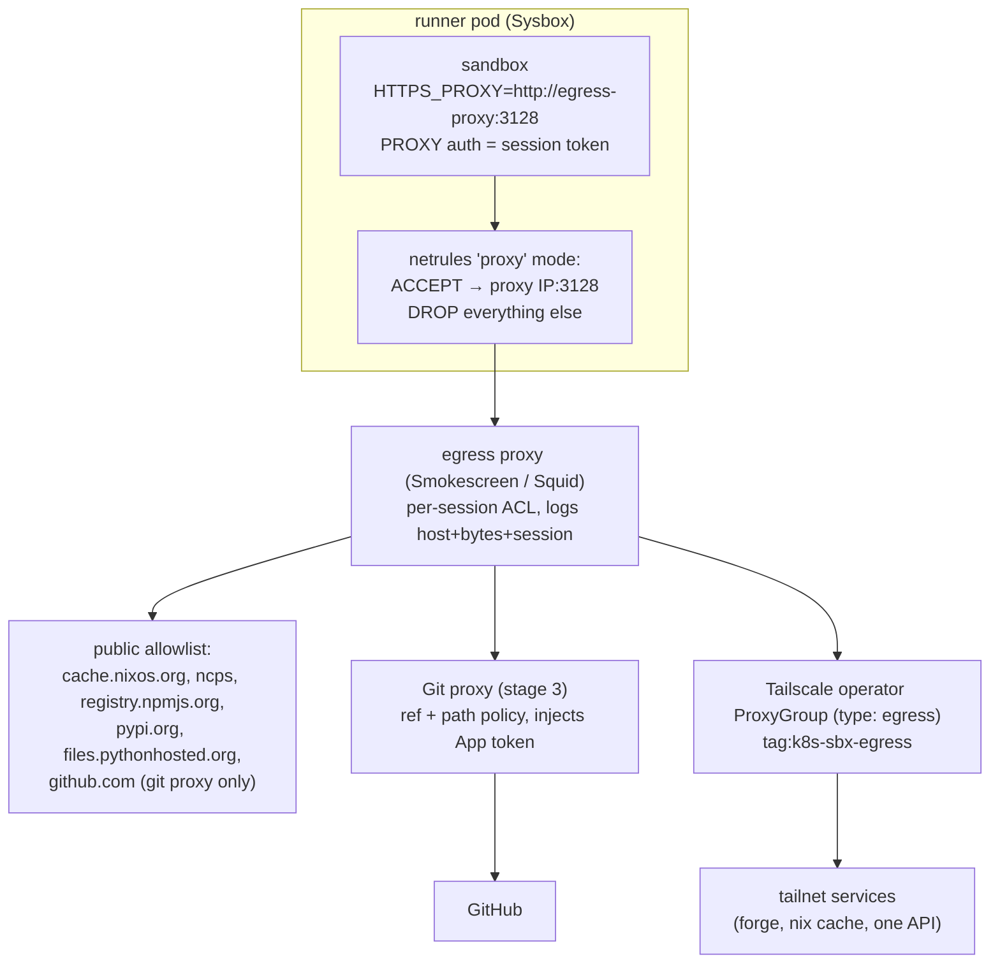

# 5. Storage and private-network access

## Persistent project storage

### Constraints

- The service has **no volume API** [V] (`docker_client.go:155-183`). A PVC
  can reach a sandbox only if the runner is patched to bind-mount a
  subdirectory of a volume mounted on the runner pod. Pod volumes are fixed at
  pod creation, so per-project PVCs cannot be attached dynamically [I].
- All sandboxes on a runner share one pod. RWOP ("read-write by a single Pod",
  GA in 1.29 [D](https://kubernetes.io/docs/concepts/storage/persistent-volumes/#access-modes))
  therefore cannot stop two sandboxes on one runner from sharing a volume.
  Exclusivity must come from the orchestrator [I].
- The disk quota covers only the Docker writable layer [D]
  (`docs/configuration.md`, "Disk quotas"). A bind-mounted workspace would
  have **no quota** unless it gets its own XFS project quota.
- Under Sysbox, host files mounted into the container keep their ownership
  only through ID-mapped mounts (kernel ≥ 5.12) or shiftfs. Otherwise they
  appear as `nobody:nogroup`
  [D](https://github.com/nestybox/sysbox/blob/master/docs/user-guide/storage.md).
  How that combines with a CSI PVC under `hostUsers: false` is **unverified**
  and needs a test.
- Stopped sandboxes keep their writable layer until delete, so a tampered
  `/nix` or `$HOME` survives wake [I].

### Options

|                 | Git as persistence                           | Persistent workspace volume                                                                                                                                                                                           |
| --------------- | -------------------------------------------- | --------------------------------------------------------------------------------------------------------------------------------------------------------------------------------------------------------------------- |
| Source of truth | The forge, already backed up                 | The volume: needs snapshots and backups                                                                                                                                                                               |
| Concurrency     | Each sandbox has its own tree and branch     | Needs a one-writer lease; `index.lock` races; NFS lock reclaim limits on RWX (Longhorn discards unreclaimed locks after its grace period [D](https://longhorn.io/docs/latest/nodes-and-volumes/volumes/rwx-volumes/)) |
| Poisoning       | Discarded with the sandbox                   | `.git/hooks`, `.git/config` (`core.fsmonitor`, `core.hooksPath`), `.envrc` and `node_modules` persist into the next session                                                                                           |
| Service changes | None                                         | Runner fork or patch                                                                                                                                                                                                  |
| Cost            | Re-clone and re-install; mitigated by caches | Warm start                                                                                                                                                                                                            |

**Recommendation:**

- **Git is the persistence layer.** Use `ephemeral: true` sandboxes. The
  agent's work survives as an `agent/<task>` branch (stages 1–2: created by
  the broker).
- **Uncommitted state.** At task end or on timeout, the orchestrator commits a
  WIP snapshot to the branch. No state lives only in a sandbox.
- **Caches, not workspaces, if cold starts hurt:**
  - **Nix:** a pull-through cache, e.g. [ncps](https://github.com/kalbasit/ncps),
    which re-signs cached paths with its own key. For the owner's own builds,
    [Attic](https://docs.attic.rs/introduction.html) (managed signing,
    pull-only tokens for sandboxes) or
    [Harmonia](https://github.com/nix-community/harmonia). Sandboxes get
    **pull-only** access, and only trusted CI pushes. Because RFC1918 is
    blocked, a sandbox reaches the cache only through the egress proxy
    (stage 4), or through a public, authenticated endpoint.
  - **npm/PyPI:** a pull-through mirror (Verdaccio, devpi) behind the same
    proxy.
  - **Bake the common toolchain into the image.** It already carries node,
    python, gcc and the n8n workspace.
- **Never share or persist a writable `/nix` between sandboxes.** It is
  owned by uid 1000 and any agent can rewrite store paths [I].

If a persistent workspace becomes necessary later:

- Mount one XFS volume per runner at `/workspaces` (StatefulSet
  `volumeClaimTemplates`, RWO).
- Patch the runner to bind `/workspaces/<project>` to `/home/user/work`
  when the create request has a project id.
- Give each project directory an XFS project quota (`xfs_quota -x -c 'project -s'`).
- `chown 1000:1000` project directories once.
- Keep a lease table in n8n. Reset `.git/hooks` and `.git/config` on attach.
- Back up with Longhorn/CSI snapshots rather than Velero file-system backup:
  Velero FSB cannot back up a PVC with no running pod
  [D](https://velero.io/docs/main/file-system-backup/), and stopped sandboxes
  have none.
- Retention: keep a workspace 14–30 days after the last push. Delete only
  after its branch is merged or closed, never together with the sandbox.

## Egress design

### How sandbox traffic leaves the cluster [I]

```
sandbox (uid 1000) ─veth─► runner-bridge ─► DOCKER-USER (drop denylist) ─► MASQUERADE
  ─► runner pod netns (pod IP) ─► CNI: NetworkPolicy / Cilium sees the *runner pod* ─► node ─► world
```

Consequences:

- A Kubernetes NetworkPolicy on the runner pod applies to **every sandbox on
  that runner, plus the runner itself**. It cannot tell sandboxes apart.
  NetworkPolicy is L3/L4 only, with no FQDN rules
  [D](https://kubernetes.io/docs/concepts/services-networking/network-policies/).
- Docker's embedded resolver forwards from dockerd in the runner namespace
  [D](https://docs.docker.com/engine/network/). Those queries are locally
  generated, so `DOCKER-USER` doesn't filter them. A `public` sandbox can
  probably resolve cluster names and tunnel data over DNS [I]. Cilium's DNS
  proxy with `toFQDNs` / DNS L7 rules on the runner pod would close this
  [D](https://github.com/cilium/cilium/blob/main/Documentation/security/policy/layer7.rst).
  Which CNI the cluster runs is **not recorded in this repository** and must
  be checked.

### Staged design

**Stages 0–2: no runner changes.**

- **Trust tiers as separate service deployments.** An untrusted-input tier
  pins `egress: none` in the orchestrator. A dependency-fetching tier uses
  `public`.
- **Egress NetworkPolicy on the runner pods.** Allow the inner registry pull,
  API gRPC, DNS to kube-dns, and `0.0.0.0/0` except the cluster, node and LAN
  CIDRs. This is a backstop for the runner itself. The runner's own iptables
  already block RFC1918 for sandboxes.
- **With Cilium, DNS L7 on the runner pod:** allow resolution of public names
  only, and refuse `*.cluster.local`.
- Private services stay unreachable.

**Stage 3+: proxy egress mode (runner patch, proposed upstream).**



- **The runner patch.** A third egress mode that adds one `ACCEPT` for the
  proxy's IP and port before the denylist drop, and drops all other forwarded
  traffic. The change is small and fits existing code (`netrules.go:158-177`
  chain builder, `netpolicy/private_ranges.go`). It is a fork until upstream
  accepts it.
- **The proxy.** [Smokescreen](https://github.com/stripe/smokescreen) is a
  CONNECT proxy with hostname ACLs. It refuses internal IPs unless they are
  explicitly allowed, and supports per-client ACLs. Authenticate sessions with
  proxy credentials, or with mTLS client certificates minted per task.
- **Allowlist caveat.** Allowing `github.com` generally allows exfiltration
  (pushing to any repository, gists). The Shai-Hulud npm worm published stolen
  secrets to public GitHub repos
  [D](https://www.cisa.gov/news-events/alerts/2025/09/23/widespread-supply-chain-compromise-impacting-npm-ecosystem).
  Route GitHub only through the Git proxy. Prefer mirrors over direct
  registries.

### Private network access through Tailscale

| Option                                                                                                                                                                         | Assessment                                                                                                                                                                                                                             |
| ------------------------------------------------------------------------------------------------------------------------------------------------------------------------------ | -------------------------------------------------------------------------------------------------------------------------------------------------------------------------------------------------------------------------------------- |
| **Operator egress ProxyGroup** (`spec.type: egress`, `tailscale.com/tailnet-fqdn` ExternalName Services) [D](https://tailscale.com/kb/1438/kubernetes-operator-cluster-egress) | **Adopt.** One cluster Service per private target. A single target IP per Service, no ranges [D](https://tailscale.com/docs/kubernetes-operator/reference/limitations). Only the egress proxy may reach these Services (NetworkPolicy) |
| Operator auth by workload identity federation [D](https://tailscale.com/docs/kubernetes-operator/manage-and-configure/workload-identity-federation)                            | Prefer over a long-lived OAuth client secret                                                                                                                                                                                           |
| Grants [D](https://tailscale.com/kb/1324/grants)                                                                                                                               | `tag:k8s-sbx-egress` → only named `dst` tags on named ports (`tcp:443`). Deny by default. Nothing may connect _to_ the tag                                                                                                             |
| Subnet router, exit node, Connector                                                                                                                                            | **Reject.** Exposes whole networks                                                                                                                                                                                                     |
| A tailnet node per sandbox (auth key, userspace networking [D](https://tailscale.com/kb/1112/userspace-networking))                                                            | **Reject.** The agent would hold the auth key, could enrol attacker devices until expiry, could run `serve`, and gets a tunnel past every domain filter. It gives nothing a per-session proxy ACL doesn't                              |
| Funnel [D](https://tailscale.com/kb/1223/funnel)                                                                                                                               | Never grant the `funnel` nodeAttr to any `tag:k8s*`                                                                                                                                                                                    |
| Tailnet lock [D](https://tailscale.com/kb/1226/tailnet-lock)                                                                                                                   | Compatible with a small, fixed ProxyGroup (pre-signed keys). Combining it with the operator is unverified                                                                                                                              |

Current state: this repository configures only Tailscale clients
(`modules/hosts/network/default.nix:16-37`). The tailnet policy file, tags and
the operator live elsewhere and must be reviewed with this design.
