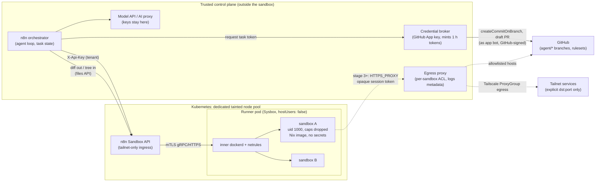

# AI-native Nix sandbox: research and proposed architecture

Status: **research for review, 2026-09-25.** Nothing here has been deployed.
No secret, credential, cluster object or GitHub setting was changed.

The sandbox image in `packages/sandbox-image` and
`hosts/sandbox/users/user/home-configuration.nix` is the starting point. This
research reviews it against the n8n Sandbox Service, the secret system in
this repository, and the Git, storage, network and isolation options for
autonomous agents.

| Document                                               | Covers                                                            |
| ------------------------------------------------------ | ----------------------------------------------------------------- |
| [01-n8n-sandbox-service.md](01-n8n-sandbox-service.md) | Verified behaviour of the service (objective 1)                   |
| [02-profiles.md](02-profiles.md)                       | Human/agent profile split and Nix module proposal (objective 2)   |
| [03-secrets.md](03-secrets.md)                         | Secret system and runtime delivery options (objective 3)          |
| [04-git-credentials.md](04-git-credentials.md)         | GitHub auth, identity and signing (objective 4)                   |
| [05-storage-network.md](05-storage-network.md)         | Persistent storage, egress and Tailscale (objective 5)            |
| [06-threat-model.md](06-threat-model.md)               | Threat model and residual risks (objective 6)                     |
| [07-proof-of-concept.md](07-proof-of-concept.md)       | Staged proof of concept with disposable credentials (objective 7) |

Skills for the n8n agent that drives the sandbox, ready to copy:

- [skills/sandbox-repo-io](skills/sandbox-repo-io/SKILL.md): moving a
  repository into the sandbox, and changes back out through GitHub tools
- [skills/sandbox-commands](skills/sandbox-commands/SKILL.md): output limits,
  long-running jobs and background servers
- [skills/shared-space](skills/shared-space/SKILL.md): the R2 bucket every
  agent reaches as the rclone remote `shared:`

The environment card the image ships to agents is
[`hosts/sandbox/users/user/AGENTS.md`](../../hosts/sandbox/users/user/AGENTS.md).

## Evidence labels

- **[V] Verified.** Read in source code or configuration, with a `path:line`
  citation. n8n citations refer to commit `81bf9b0` (v1.4.0), which is what
  `flake.lock` pins. v1.5.0 (`14393cf`, released 2026-09-25) only adds
  provisioner API keys and more error-log context. It changes nothing in the
  sandbox, daemon or network code discussed here.
- **[D] Documented.** Stated in official documentation, with a URL.
- **[I] Inferred.** Reasoning from verified facts, not yet tested. Each [I]
  claim that matters has a test in the proof of concept.

## Findings that need action before anything else

1. **A notification channel with no authentication is published.** The
   `personal` MCP server URL (`modules/home/agents/mcp.nix:49-57`) is a
   capability URL with no authentication, and the repository is public. Anyone
   can push notifications to the owner's phone, WeChat and Slack. Every agent
   config in the current sandbox image also contains it. Recommended: rotate
   the n8n webhook path, keep the URL out of Git (agenix or a
   runtime-substituted file), and add authentication. _Not done here: it is a
   production secret change._
2. **The current sandbox image assumes a person, not an agent.** It carries the
   owner's Git identity and signing setup, SSH host aliases with
   `ForwardAgent yes`, Atuin sync, agent configs that expect agenix secrets,
   and `accept-flake-config = true`. See [02-profiles.md](02-profiles.md#leaks-in-the-current-image).
   Do not push that image to a registry the cluster pulls from until the agent
   profile replaces it.
3. **One age identity decrypts every secret.** `secrets/secrets.nix` encrypts
   all 15 secrets to one recipient, including backup-encryption and NAS
   credentials. Any design that puts this key near an agent exposes all of
   them. See [03-secrets.md](03-secrets.md).

## Proposed architecture

The sandbox is a disposable, credential-free execution plane. Everything
trusted runs outside it: the model loop, identity, credentials, policy and
persistence.

Default operating mode (no runner changes needed):

- **Model loop in n8n.** The agent's reasoning runs in n8n, and the sandbox is
  its tool for exec and files. Model API keys never enter the sandbox.
- **Git through the orchestrator.** n8n or the broker clones the repository
  and uploads it through the files API. It collects the diff and commits it
  through GitHub's API as a dedicated GitHub App. Commits are signed and
  verified by GitHub. The sandbox never holds a GitHub credential.
- **Egress.** `egress: none` for work on untrusted input. `public` only when
  the task must fetch dependencies, and then the sandbox holds nothing worth
  stealing. Private networks are unreachable by default, and that is kept.
- **Isolation.** Sysbox runner on a dedicated, tainted node pool. Never the
  privileged runner outside a lab.
- **Persistence.** Git is the persistence layer. Sandboxes are `ephemeral`.
  There is no shared writable `/nix`.

Later stages add an authenticated egress proxy and an in-sandbox Git proxy.
They need a small runner patch (a "proxy" egress mode) and a proxy on a
reachable address. [05-storage-network.md](05-storage-network.md) has the
design and [07-proof-of-concept.md](07-proof-of-concept.md) the stages.

## Option comparison at a glance

| Decision                  | Recommended                                                       | Rejected (why)                                                                                            |
| ------------------------- | ----------------------------------------------------------------- | --------------------------------------------------------------------------------------------------------- |
| Where the agent loop runs | n8n (outside)                                                     | CLI agents inside the sandbox with raw model keys: the key is readable by the agent                       |
| GitHub auth               | GitHub App installation token: 1 h, one repo, no `workflows`      | Personal SSH key or agent forwarding (whole account). Deploy keys (never expire, no PR API). Classic PATs |
| Commit identity           | App bot, with the owner as `Co-authored-by`                       | The owner's identity: misattribution, and it pushes agents to skip signing                                |
| Signing                   | GitHub-signed API commits (`createCommitOnBranch`)                | Signing keys in the sandbox. gitsign: not in GitHub's trust root                                          |
| Runtime secrets           | None in the sandbox. Broker and proxy hold them                   | Injected age key (decrypts everything, forever). Per-exec env for long-lived secrets                      |
| Broker secret storage     | agenix with a dedicated recipient on the broker host              | The existing single master key                                                                            |
| Egress                    | `none` by default. Later a proxy mode with allowlists             | `public` plus secrets in the sandbox. A tailnet node per sandbox                                          |
| Private access            | One Tailscale operator ProxyGroup, reached only through the proxy | Subnet router, exit node, or per-sandbox auth keys                                                        |
| Isolation                 | Sysbox runner on a tainted pool                                   | Privileged DinD runner. Firecracker is Enterprise-licensed for production                                 |
| Storage                   | Git plus optional per-project cache                               | Shared RWX working trees. Shared writable `/nix`                                                          |

## Residual risks the owner accepts with this design

- A shared-kernel zero-day under Sysbox compromises the runner, and n8n
  documents that runner credentials are fleet-wide.
- Anything the agent pushes to an `agent/*` branch is attacker-controlled
  content. Review is the control: CI on agent branches must not see secrets,
  and a human merges.
- With `public` egress, the agent can send anything it can see to the
  internet, including exfiltration over DNS. The design keeps the sandbox free
  of secrets rather than trying to stop that traffic.
- Content leaves the sandbox through n8n: the diff, command output and
  execution logs. n8n stores execution data, and the daemon logs every command
  string. Secrets must never appear in commands or outputs.

Full list: [06-threat-model.md](06-threat-model.md#residual-risks).
